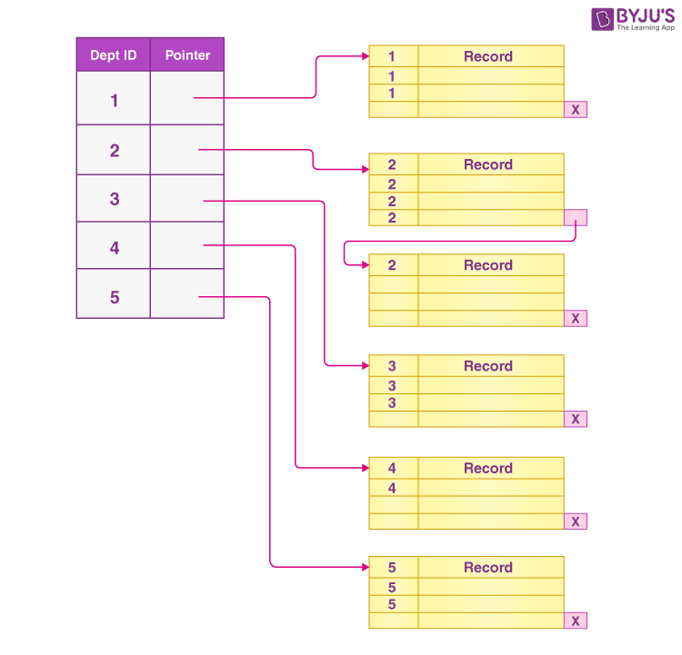
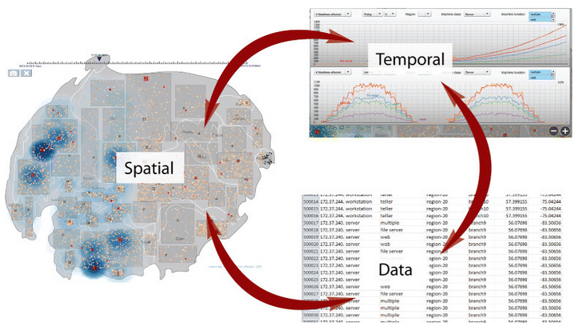
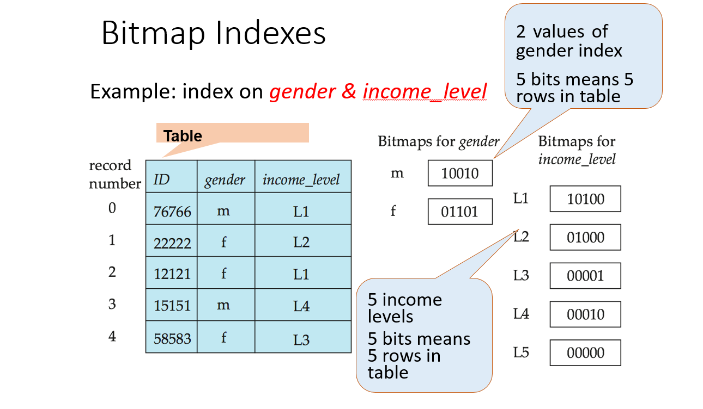
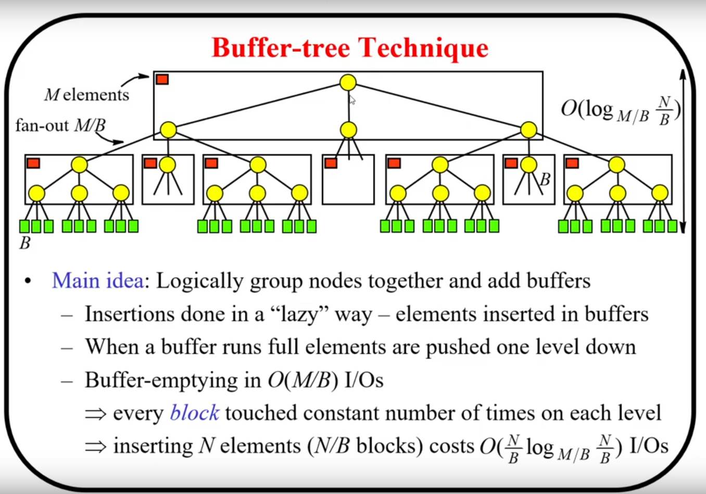

## Topic : Indexing

The process of making an index in a database is equivalent to creating data structures that house a fraction of the records from tables, which in return improves the searching process during retrieval of data. Indexing is vital because the DBMS won’t be compelled to scan an entire table for data retrieval because indexes remarkably improve queries performance so that the DBMS can quickly find and retrieve such data. 

The main types of indexes are:The main types of indexes are: 

 - B-Tree Index: Apart from the boolean tasks, they are also used for other kind of queries such as the equality comparisons, range queries, and pattern matching. 
 - Bitmap Index: The field type is set to column if the number of distinct values is small and the logical operation type is used in the queries. 
 - Spatial Index: With the use of the terms geographic/geometric data best for indexing. 
 - Hash Index: Using equal to comparison is pretty simple for equality comparisons but not feasible for range queries. 
 - Full-Text Index: A textual search tool allowing speedy connections of text documents, using words or key phrases as the target elements for search. 
 - Composite Index: The Search Engine enforces the ranking from numerous columns of a table. 
 - Many more are there.

Indexes do not notice any changes in read performance however they could contemplate write performance and may also consume some extra storage space. Database administration activities deal with various data structures such as selectivity of queries and table row distribution in hashing mainly to achieve both read and write performance optimization. 

During the flipped class, we discussed about this 3 type of indexing:
 - Spatial and Temporal Data
 - Bitmap Indices
 - Buffer Tree

### Indexing of  Spatial and Temporal Data

Indexing of spatial data and time is a critical element for life services, geographic information systems (GIS), and time series analysis. Same as that, it is about placing and categorizing data in such an order that allows for a fast recovery and searching based on spatial and temporal clues. 
 
1. Spatial Data Indexing: 

 An innovative spatial data indexing involves indexing geographic information like, points, lines, polygons and other shapes in geometry. The primary aim is to devise efficient queries that can use all the spatial operations such as distance computation, cartesian, containment, and nearest nearest neighbor searches. Common spatial indexing techniques include:Common spatial indexing techniques include:
 
 - . R-Tree and its variants (R*-Tree, R+-Tree): To make spatial search faster, a spatial index, which is based on tree, groups spatial objects having nearby spaces into a hierarchy in depth and forms nested rectangles (bounding boxes). By using this technique, the proximity based query system becomes effective as well. 
 
 - b. Quadtree and its variants: This recursive partitioning scheme is used to divide the space into quadrants or regions with each node representing a specific spatial area, which is reiterated in a tree-like structure. Quadtrees are fitting for point datums and bounding-region queries. 
 
 - c. Grid-based indexing: This approach consists of plotting the spatial data on a fine grid system with objects located to the respective grid cells. Accordingly, the search queries can be processed by scrutinizing the grid cells which correspond to the specified query-information, thereby cutting down the range of places to be examined. 

2. Temporal Data Indexing: 

 Temporal data indexing is used for indexing data that has a time component, such as time-series data, historical records, or event logs. The goal is to enable efficient retrieval and querying based on time intervals, ranges, or specific time points. Common temporal indexing techniques include:
 
 - a. B-Tree and its variants (B+-Tree, B*-Tree): These equated tree data structures can be enhanced conveniently to index time-based information by using time as the key. They are indeed favorable in key-word extraction and corresponding queries. 
 
 - b. Interval Tree: It's a data structure which is specialized in indexing (expressing) intervals (time periods) and answered it swiftly if any or both intervals overlap or if any interval contains another interval. 
 
 - c. Bitmap indexing: In such technique, each time-value or the specific interval depending on the range of value of data is represented in the binarized format where each bit corresponds the presence or absence of data for that time-value of interval. Bitmap indexing may be regarded as a highly efficient technique to attain the purpose of uncovering and processing macrotressory data. 
 
3. Spatio-Temporal Data Indexing: 

 Precisely speaking there are some cases when data might have an upper hand on more than a dimension, making it vital for indexing methods that can easily cope with simultaneous spatial and temporal dimensions. Examples of spatio-temporal indexing techniques include:Examples of spatio-temporal indexing techniques include:
 
 - a. 3D R-Tree: Furthermore, it is a development of the R-Tree that extends the functionality in order to accommodate the temporal dimension besides spatial dimensions and thus, the indexing and querying of spatio-temporal data becomes possible. 
 
 - b. Quadtree-based approaches: Similar to the quadtree, variants like the Spatial-Temporal Quadtree (STQT) and the Scalable Spatio-Temporal Quadtree (SSTQ) have built-in functionalities such as indexing and querying spatio-temporal data by sharing out the space and time dimensions. 
 
 - c. Hybrid approaches: ee combine spatial and temporal indexing methods of indexing M-Tree approach spatial indexing and B-traverse for temporal indexing, and then merge the results using special algorithm

Though the indexes already improve query speed, they also lead to extra work when the index structures have to be updated during insert, modification, and deletion procedures. Database administrators (DBAs) must make a comprehensive plan on index design, factoring in query type, distribution of data and write-read performance. 

### Bitmap Indices

 Bitmap indices is a special type of indices that provides effective searching and aggregating of data, together with data analysis applications in data warehousing practices. Not only are they efficient at simple indexing of the data with low cardinality (small variety of distinct values) such as flags, categories, or codes but they also allow more advanced compound schemes like a graph or tree indexes. 

 Correspondingly, in a bitmap index each different data value is occupied by a corresponding bit map (a series of bits). The mapping between the rows in the table and the values (0 or 1) in the bitmap array is absolutely linear – if a row has the particular column value, its corresponding bit is '1', or else it is '0'. 

 Advantages:
 - Efficient sorting with bitwise operations (AND, OR, NOT)
 - Good for limited cardinality statistics (few distinct values). 
 - Sparse storage compression (sparse data). 
 - Parallelizable operations
 
 Limitations: 
 - Unsuitable for cardinality that is high (contains many distinct values). 
 - It is expensive to support the data changes with inserts/updates/deletes on a regular basis. 
 - Bitmap projections have high overheads of encoding/decoding that are unsuitable for non-bitmap queries. 
 
 Used in:
 
 - Data mart and OLAP for analytical queries (data analysis). 
 - Full-text search engines
 - In order to achieve high-performance applications that require fast and precise bitwise operations. 
 
Bitmap indices preserve well the small amount of data and critical operations of filtering, aggregations, and measures calculation, but do not perform the best for high cardinality data and often updated datasets. 

### Buffer Tree

 Buffer tree, which is sometimes also referred to as B-Tree (Balanced Tree), is a kind of indexing data structure widely applied in solving database indexing problem. This technique is widely referred to as B-Tree due to its generalized nature of binary search tree, which allows more than just two child nodes per node. 
 
 1. Node Structure: 
 Each B-Tree node consists of a number of keys and child pointers. A node can only have the maximum number of keys (also referred to as the order or branching factor of the tree) and the number of its child pointers must be equal. The node's key's order is maintained in an ascending order. 
 
 2. Properties:
 - The leaf nodes are always on the same level (balanced tree). 
 - Every non-root node (except root node) contains at least ⌊m/2⌋ keys, where m denotes order of the tree (maximum number of keys in one node). 
 - Within a node,  keys are in ascending order. 
 - Here each the key in the non-leaf node behaves like the separator, separating the ranges of the values in its child nodes. 
 
 3. Operations:
 
 - Search: 
 To lookup for a key in B-Tree, the procedure starts in the root node and follows the link according to the value of the key and the separators used there. This procedure is repeated tirelessly until the key is located in the leaf node or the search ends unsuccessfully. 
 
 - Insertion: 
 Inserting a new key in this data structure requires that it be entered into a leaf node. In this case, leaf node is split into two nodes at the middle key and the middle key is promoted to the parent node. This process continues recursively and break down the root node into two by creating a new root node. 
 
 - Deletion: 
 Deleting a key in leaf node requires neighboring keys to be relocated or neighboring nodes to be merged in order to ensure that the B-Tree properties are still maintained. If a key is deleted from a node that is not a leaf node, it is substituted by its predecessor or successor, and the process continues recursively until the deletion reached the leaves. 
 
 4. Balanced Tree: Unlike the most popular trees, B-Trees are self-balancing in practice, which involves redistributing keys and rebuilding the tree structure to ensure the tree height is maintained. Due to this factor, the complexity of the operations like search, insertion, and deletion are with a logarithmic time course (O(log n)), where n stands for the number of keys in the tree. 
 
A common data structure for database records indexing is B-Tree as it provides fast search, insertion, and deletion operations. They are ideal for the indexing since they use a technique of locality preserving which helps in keeping related keys together within the same node. Moreover, B-Trees are born to perform well with disk block systems that are common with secondary storage devices like hard disks and, hence, they form the ultimate database index choices. 

### Conclusion

 I learnt that indexing is the most important tool in databases and a better query performance is always accompanied by relevant data retrieval. Various kinds of indexes are in place to sort-out certain data traits and make it possible to answer the queries. Spatial and temporal data indexing are created for geographical data and time-based data at the same time, bitmaps indexes are the best option for the columns with a low cardinality and logical operations, and (bitmaps index) are used the most widely for general-purpose indexing in database. Being well familiar with last two indexing methods is a key to success to achieve high database performance and taking circuitous indexing strategy, thus. 

### Reference 

- IBM. (2024). Informix Servers 12.10 Documentation: Objects - Spatiotemporal Search Indexing. IBM Knowledge Center. https://www.ibm.com/docs/en/informix-servers/12.10?topic=objects-spatiotemporal-search-indexing
- GeeksforGeeks. (2024). Bitmap Indexing in DBMS. GeeksforGeeks. https://www.geeksforgeeks.org/bitmap-indexing-in-dbms/
- Middle East Technical University. (2024). B-Trees. CENG351 Documents. https://saksagan.ceng.metu.edu.tr/courses/ceng351/documents/btrees.pdf