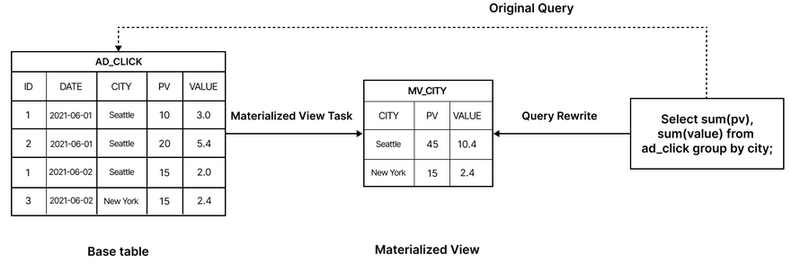
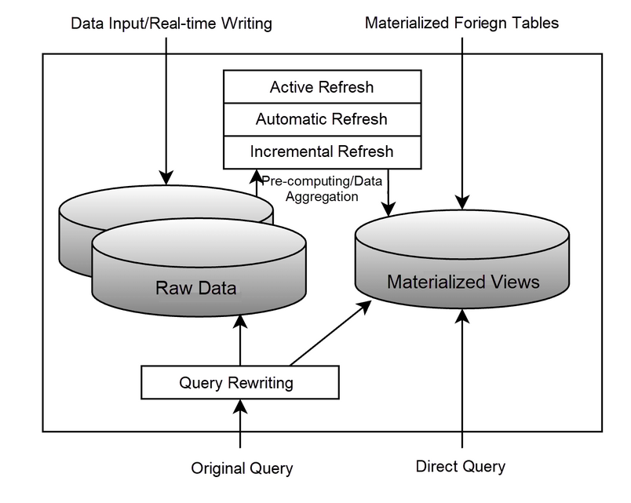

## Topic : Materialized Views and Advanced Query Optimization Techniques

Today I have studied more about the advanced concepts associated with the query optimization in databases. A major topic was materialized views, which are query results or views precomputed and stored on disk. The main advantage of materialized views is that they can greatly accelerate queries that need expensive operations like aggregations or joins on large data sets. Rather than recomputing the whole query from the beginning on the base tables, the query can just look up and get the precomputed materialized view.

 
Nevertheless, materialized views present the problem of maintaining their consistency with the actual base data as the updates take place. The procedure of gradually changing a materialized view in reaction to inserts, deletes or updates to the base tables is called view maintenance. The ebook provided algorithms for incrementally maintaining materialized views defined by different relational operators:

1. Join Views: 
 - For inserts to an underlying table R, compute the increment ΔR = IR ⨝ S and then add it to the view.
 - To delete from R, first compute the decrement ΔR = DR ⨝ S and then remove it from the view.
 
2. Selection/Projection Views:
 - For the inserts, compute σ(IR) or π(IR) and include it in the view.
 - For deletes, find σ(DR) or π(DR) and delete from view.
 - For projections, a count is kept of how many underlying tuples map to each view tuple.
 
3. Aggregation Views:
 - For instance, for count, sum, avg - increase/decrease the running aggregate depending on the added/removed tuples.
 - For min/max - it might be necessary to rescan groups to find new min/max.

The main idea is to use the sets of inserts (IR) and deletes (DR) to calculate the changes or differentials which will be applied to the view instead of recomputing the whole view. This can give the performance boost.

Materialized views management demands, in order, to take into account the combination of queries and updates in the workload. Administrators make use of the tools that check the historical workload of the queries and updates to suggest the views that should be materialized. The aim is to choose a collection of views that will give a net performance benefit by making important queries faster without slowing down the updates that need to keep those views up to date.
Other advanced optimization topics covered include:

 - Top-K Optimization: For queries that only need the top K ranked results, techniques like introducing range predicates or sorted pipelined plans can avoid computing the full result set.
 - Join Minimization: Eliminating redundant joins from queries, for example by removing joins implicitly captured by foreign key constraints.
 - Update Optimizations: Techniques to avoid the Halloween problem where updates can interact incorrectly with open scans/cursors. Solutions include separating the read and update steps.
 - Multiquery Optimization: Identifying and computing common subexpressions across a batch of queries just once to improve sharing.
 - Parametric Query Optimization: Pre-computing and caching optimal plan choices for parameterized queries based on the parameter values.

Through the usage of these optimization methods, one is able to see the complexity of today's query optimizer. The efficient implementation of such methods like materialized views, top-K retrieval, incremental view maintenance and multi query optimization can be a great thing if it will be used for complex queries over large data sets, therefore, it will provide huge performance gains. 

The study of these concepts made me understand the work of database vendors in this area better and gave me a deeper appreciation for it. Query optimization is the key to good database performance, but putting advanced optimizations into practice is very hard because of the variety of possible queries, the interaction between the techniques, and the impact on the conjunctive query processing, updating, concurrency control and more. The research of this subject proved how much complexity and engineering it takes to make a strong and efficient database engine. 

