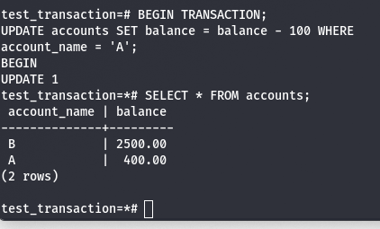

## Topic : Transaction and Serializability in Database

A transaction is defined as a logical unit of work that consists of one or more operations that access or modify data in the database. It is widely used in database systems, distributed systems, and other applications that require reliable and consistent data management. They help ensure data integrity, prevent inconsistent or partial updates, and provide a way to roll back changes if any part of the transaction fails.

The ACID properties define the requirements for transactions:
- `Atomicity`: Either all operations complete successfully or none of them do. There is no partial completion.
- `Consistency`: A transaction transforms the database from one valid state to another valid state based on defined rules.
- `Isolation`: Concurrent transactions appear to execute in isolation from each other, with no interference between them.
- `Durability`: Once a transaction completes successfully, its effects persist in the database, even in the event of a system failure.

The transactions in Postgresql:

In a nutshell this code creates a database and a table and subject to a few errors inserts some initial records into the table, it starts a transaction block, transfers 500 units from account A to account B and commits the transaction and finally displays transaction status. Idea of using a transaction block consists of effective transfer operation, that means subtracting from one account and adding to another as an atomic process. Should any one of the transaction process fail then they can be all be reverted back leaving the data in perfect consistence. 

The transaction model walks through an example bank transfer showing how atomicity ensures the full transfer completes or is rolled back, avoiding an inconsistent state. Durability requires logging updates to stable storage before marking the transaction as committed. Isolation prevents concurrent transactions from seeing partial/inconsistent results from each other.

### A simple abstract transaction model: 

- Active: The initial state of the transaction as the transaction is being processed. 
- Partially committed: At the end after the execution of final statement. 
- Failed: It is here also that normal execution cannot happen. 
- Aborted: Again, a database has restored to pre-transaction state. 
- Committed: Successfully completed. 

1. Active:

2. Partially Committed:

3. Failed:

4. Aborted:

5. Committed:

Thus, transactions can either enter a failed or aborted state, with the option to restart under certain error conditions. Allowing concurrent transactions leads to potential data consistency issues, which requires extra work to handle. Running transactions serially, one at a time, ensures data consistency but sacrifices concurrency and performance.
Improved throughput and resource utilization and reduced waiting time are the two reasons for allowing
concurrency.

Concurrent transactions can potentially violate the isolation property, putting the database consistency at risk, even when individual transactions are correct. To address this issue, the concept of schedules is introduced. Schedules help identify executions that guarantee isolation and maintain database consistency. Furthermore, database systems employ concurrency-control schemes to regulate the interaction between concurrent transactions, ensuring their correct concurrent execution, thereby preserving data integrity and consistency.

Concurrent executions involve interleaving the instructions of transactions and may result in some form of inconsistency or conflicts. Locking or serialization is used to provide concurrency control in a way that ensures that concurrent transactions are consistent with one another and the results are correct as if they were executed sequentially. 
Here's a some of the key points:

1. Transactions T1 and T2:
  - T1: Transfers $50 from account A to account B.
  - T2: Transfers 10% of the balance from account A to account B.

2. Serial Schedules:
  - Schedule 1: T1 → T2 (T1 executes first, followed by T2)
  - Schedule 2: T2 → T1 (T2 executes first, followed by T1)

3. Concurrent Execution:
  - Transactions are executed concurrently, with instructions interleaved in an unpredictable manner. Concurrent schedules have variable execution sequences, making it challenging to predict the final state.
  - Example, a concurrent schedule that is equivalent to Schedule 1 (T1 → T2) can maintain consistency.

4. Pitfall of Concurrent Execution:
 - Without proper concurrency control mechanisms, concurrent execution can lead to inconsistent states emphasizing the need for concurrency control techniques.

Transaction T1: Transfer $50 from account A to B
Sequential execution ensuring consistency.

Transaction T2: Transfer 10% of balance from A to B
Sequential execution preserving database integrity.

### Serializability

Serializability is a property that guarantees that the execution of concurrent transactions is equivalent to a serial (sequential) execution of those transactions. In other words, the outcome of executing a set of transactions concurrently should be the same as executing them in some serial order.

#### Ensuring Consistency with Serializable Schedules
- Serializable Schedules: Ensure that all data in the database will be consistent within concurrent executions. 
- Objective: Make critical path method schedules comparable to time-cost trade-off schedules. 
- Importance: It should be mentioned that concurrency-control mechanisms aim to provide database consistency. 
- Database System Role: Validating that every finished schedule departs the database in a consistent state. 

A schedule is a set of operations generated or initiated from one or more transactions. A serial schedule performs the transactions in a one at a time schedule regarding the other being idle. Parallel order is such an example of a non-serial schedule in which transactions can be mixed in. Serializability in turn aims at converting a non-serial schedule to an equivalent serial schedule – the resulting state of the database would then be the same in both.

There are two main ways to test for serializability:There are two main ways to test for serializability:
 
1. `Conflict serializability`:
 It enforced the phenomena of some transactions wherein the operations are conflicting between them. It builds a precedence graph whose nodes are the transactions and whose arcs depict conflict among them. g. effectively interact either through reading and writing or writing on the same data item. By having a circular relationships in the precedence graph would mean that the schedule is a circular set of transactions or non-serializable. Such a schedule is conflict serializable if it is acyclic.
 - To test using this method:
   - Determine the locations of all pairs of simultaneous operations that are incompatible.
   - For each conflict between transactions Ti and Tj of the schedule set add an transition Ti->Tj.
   - Determine if the precedence graph produced with the previous steps has a cycle.
 
2. `View serializability`:
It tests whether the non-serial schedule could be transformed into the equivalent serial schedule, by overlap scheduling shifts of non-conflicting operations. This deals with the type of cases that fall within the category of serializability misses such as “blind writes”.
 
- To test using this method:
 - Make every possible effort to build such a serial schedule S’ that is view equivalent to S.
 - Two schedules are view equivalent if:Two schedules are view equivalent if:
   - re-reads and post read of each transaction read the same data values.
   - The final writes of each transaction have their data value and writes on the same data values.
 - Reads-from operations occur sequentially in the provided order.
 - Then S is view sequential if view equivalent serial schedule S’ can be constructed since the view equivalent serial schedule implies view sequential behavior.

As serializability helps database transactions operate correctly despite concurrency. It guarantees the ACID properties of database transactions - atomicity, consistency, isolation, and durability. While checking for serializability can be computationally complex, it is a vital part of properly managing concurrent database operations.

