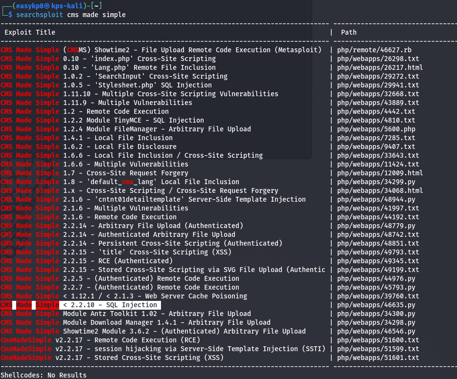

### Topic : Simple CTF - TryHackMe Walkthrough 

Today, I took on the "Simple CTF" boot2root machine on TryHackMe, created by Mr.Seth6797. It's a beginner-level challenge, perfect for someone like me who's still learning the ropes of cybersecurity and ethical hacking.
I started with an Nmap scan to identify open ports and services running on the target machine. The scan revealed that ports 21 (FTP), 80 (HTTP), and 2222 (SSH) were open. Interestingly, the FTP service allowed anonymous login, and the Nmap results also hinted at the presence of a robots.txt file on the web server.

Next, I used Gobuster to enumerate the web server for any hidden directories or files. This led me to discover a webpage named "simple," which was running CMS Made Simple version 2.2.8. A quick search on Searchsploit confirmed that this version was vulnerable to SQL injection attacks.

Armed with this knowledge, I found a Python script that could exploit the vulnerability and retrieve credentials. After running the script, I obtained a username and password. Remembering that the SSH port was open, I tried logging in with these credentials and succeeded! I was now a user named "mitch" on the target machine.

With a foothold established, my next goal was to escalate my privileges to the root user. I checked the permissions for the "mitch" user using the sudo -l command and discovered that this user could run the vim editor as root. This was the key to my privilege escalation!

I used a well-known technique to spawn a shell from within vim with root privileges. After a few commands, I had successfully gained root access on the target machine!

In conclusion, this challenge was definitely good fun and I got a lot out of it. It enabled me to learn of various engagements like; scanning through Nmap, a web content discovery tools using Gobuster, searching for vulnerabilities, and exploiting the SQl injection, escalating privileges. This boot2root machine is complete to me, and i am looking forward to more such joyful challenges in the future.

