### Topic : Pickle Rick - TryHackMe Walkthrough 

Today starts another journey through a CTF  with the help of TryHackMe, mission: Capture The Flag. This particular challenge was also known as the “Pickle Rick” challenge and it not only allowed me to test my hacking prowess but also be an exciting adventure in which there were no shortages of surprises. Now, it’s time to go deeper into the deep analysis of how I passed through this challenge and how I got the root access and the last flag. 

#### Initial Enumeration

The first step was to perform a basic enumeration of the target machine. A quick nmap scan revealed that only two ports were open:
   -  Port 22: SSH
   - Port 80: HTTP

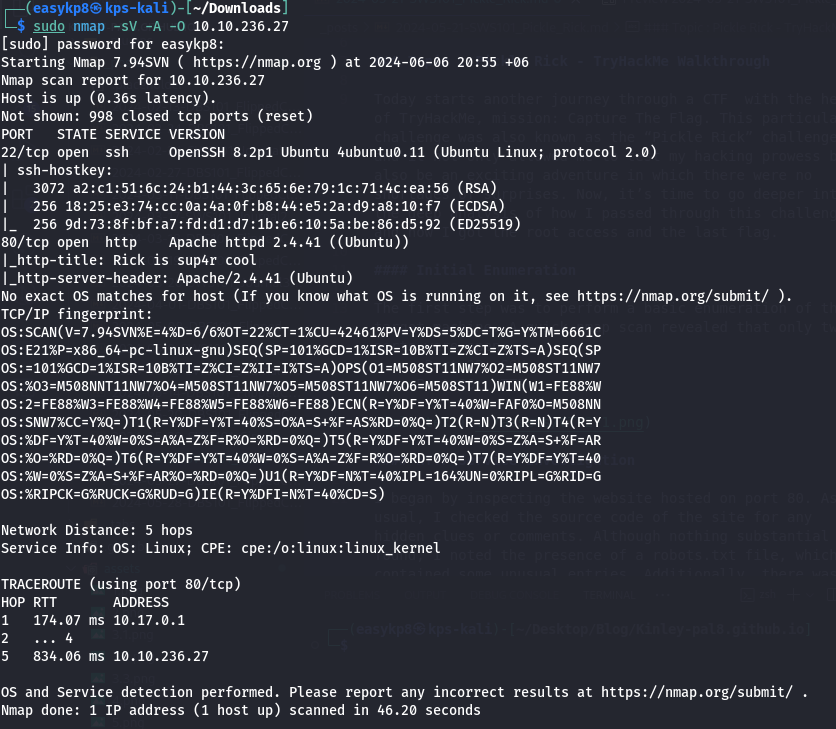

#### HTTP Service Investigation

I began by inspecting the website hosted on port 80. As usual, I checked the source code of the site for any hidden clues or comments. Although nothing substantial was found, I noted the presence of a robots.txt file, which contained some unusual entries. Additionally, there was a username mentioned but no corresponding login panel.

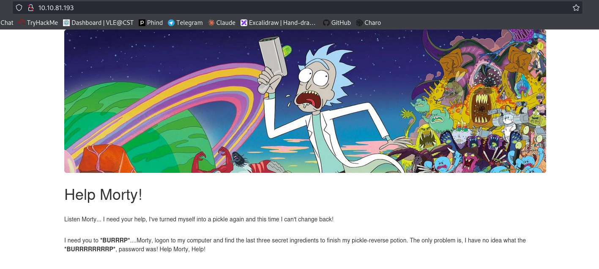

The source code:

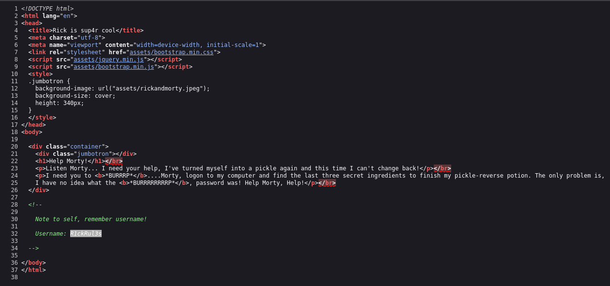

Note that username.

#### Directory Brute-Forcing

To uncover any hidden directories, I used tools like DirBuster and Gobuster. This effort paid off when I discovered a login page. My curiosity was piqued by the unusual entries in the robots.txt file, so I kept them in mind for future reference.

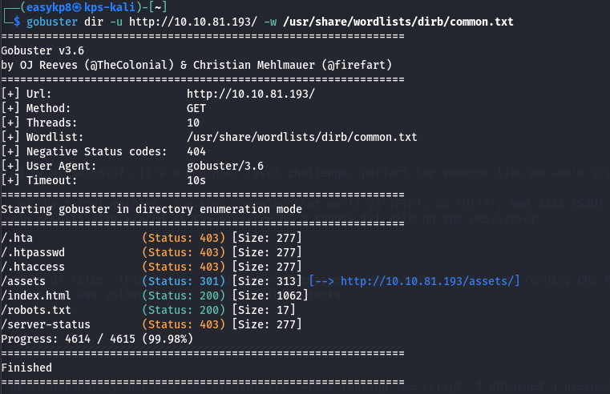
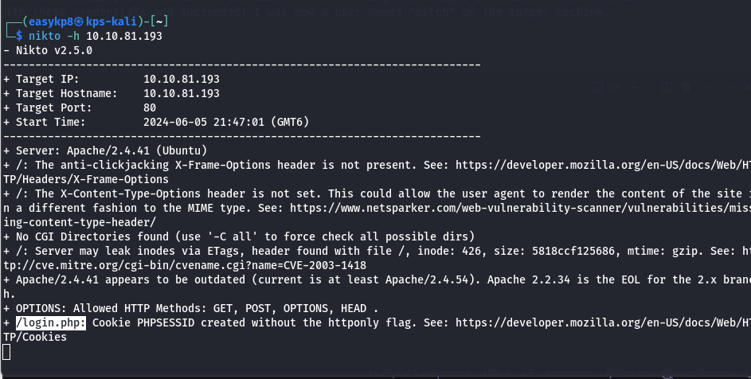
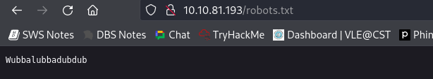

#### Gaining Initial Access

Upon finding the login page, use the username that we noted earlier and for the password I had tried the well-known quote from Rick and Morty: "Wabbalubbadubdub!!!!" which is also in the robots.txt Surprisingly, this granted me access to a command panel with www-data user privileges.

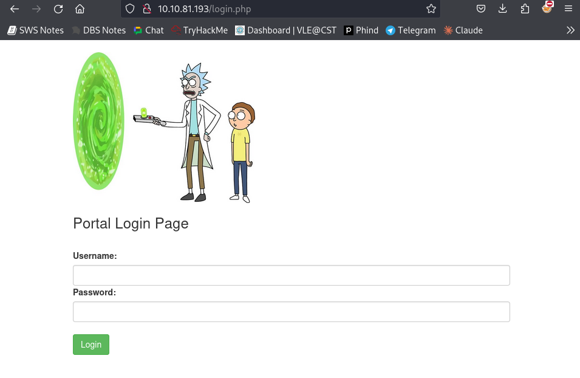
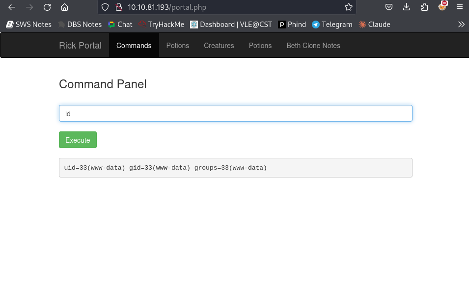

#### Command Panel Exploration

From the command panel, I listed the directory contents using ls -la and found two files:
- Sup3rwhatever.txt: Contained the first flag.
- clue.txt: Provided a hint to explore the system further.

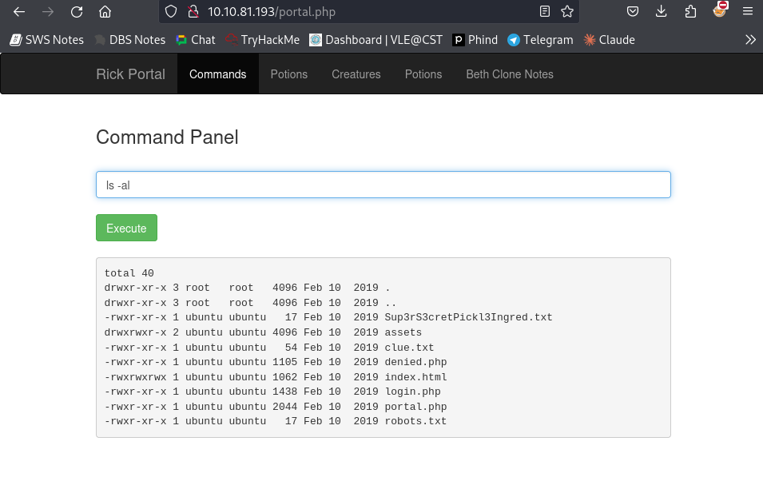
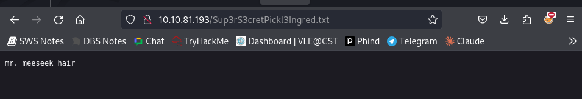
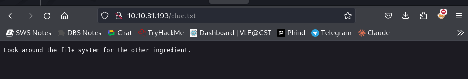

#### Attempting Reverse Shell

Feeling limited by the command panel, I attempted to gain a reverse shell. However, every time I tried, the system shut down. This was a rabbit hole, and I decided not to pursue it further. Additionally, the command panel filtered out certain commands like cat, head, and tail, making it difficult to read file contents directly.

#### Navigating System Directories

Using the find and less commands, I explored the system directories extensively. In the process, I discovered the second ingredient for Rick.

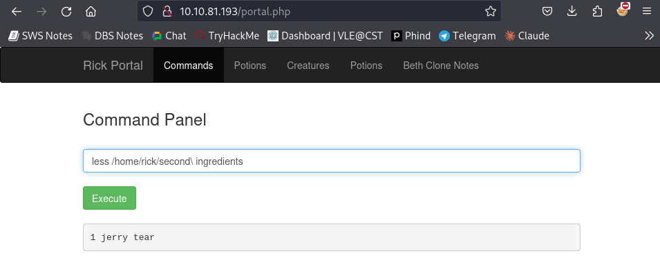

#### Privilege Escalation

After some trial and error with various commands, I decided to check for sudo privileges using sudo -l. This revealed that I had the necessary permissions to escalate my privileges.

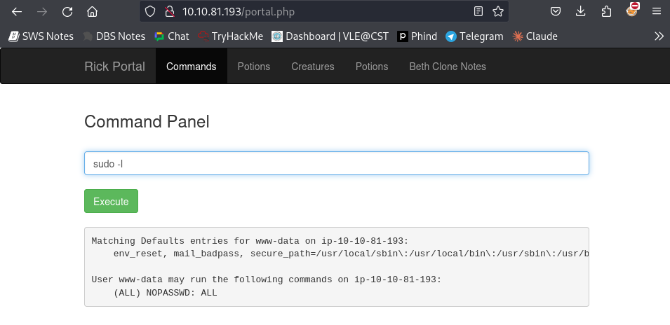

#### Achieving Root Access

With the sudo privileges in hand, I executed the required commands to escalate my privileges to root. Upon gaining root access, I located the third and final flag, marking the completion of the challenge.

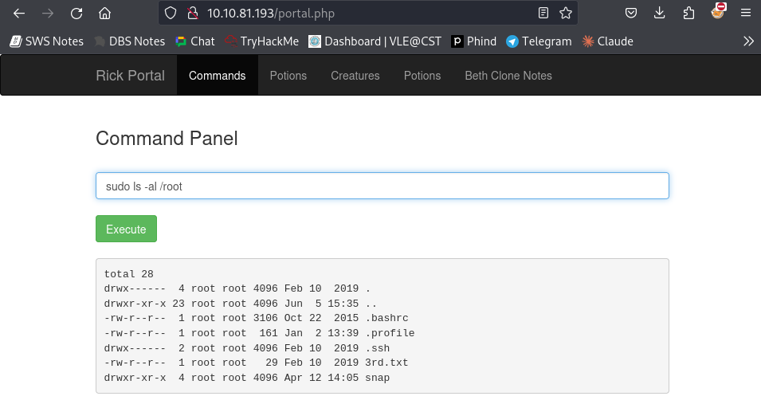

#### Conclusion

This TryHackMe CTF challenge was a delightful experience, filled with twists and turns that kept me on my toes. It was not overly difficult, but it required careful thinking and persistence. The challenge's design encouraged creative problem-solving and reinforced important techniques for navigating and exploiting a Linux system. Overall, it was an enjoyable and educational exercise, and I look forward to more challenges like this in the future.

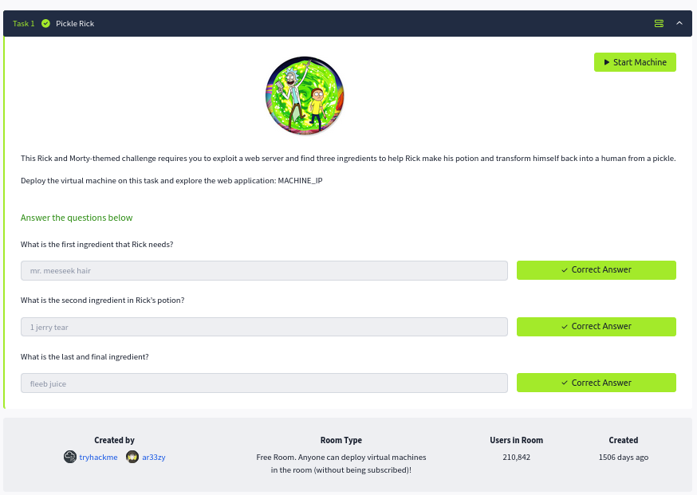
