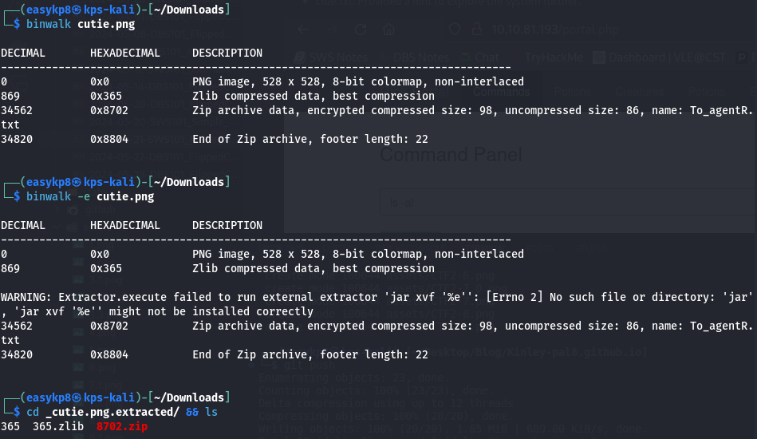

### Topic : Agent Sudo - TryHackMe Walkthrough 

I recently explored the "Agent Sudo" room on TryHackMe, a CTF challenge designed to test basic cybersecurity skills. This room, authored by DesKel, is rated as easy and serves as an excellent revision for fundamental concepts. This entry documents my journey through the tasks, the tools I used, and the techniques applied to solve each step.

#### Tools and Preparation

Before diving into the tasks, I ensured my setup was ready:

- Kali Linux VM: Essential for penetration testing tasks.
- Basic Linux Commands Knowledge: Fundamental for navigation and execution of various commands.
- Nmap: For network enumeration.
- Hydra: For brute-force attacks.
- binwalk: For analyzing files.
- CyberChef: For decoding encoded messages.
- steghide: For steganography tasks.
- john (John the Ripper): For cracking password hashes.

I deployed the machine provided by TryHackMe and waited for it to boot up.

#### Task 1: Enumerate

The first step was to identify open ports and services using Nmap:

nmap -sS -sV -A -T4 -vv machineip

Nmap revealed a web server running on port 80. Visiting the site, I learned that agents should use their codenames as the user-agent to access the site.

Using curl, I tested different single-letter codenames until I found one that worked:

curl -A "C" machineip

This revealed a username, indicating progress.

#### Task 2: Hash Cracking and Brute-force

Next, I needed the FTP password. Using Hydra with the rockyou.txt wordlist, I attempted to brute-force the FTP login:

hydra -l username -P /usr/share/wordlists/rockyou.txt ftp:// machineip

Hydra quickly provided the correct password. Logging into the FTP server, I downloaded all available files. Among them was a PNG file, which I suspected contained hidden data. I used binwalk to analyze it:

binwalk -e file.png

Binwalk extracted files, including a zip file that was password-protected. Using zip2john and john, I cracked the zip password:

zip2john file.zip > ziphash.txt
john ziphash.txt --wordlist=/usr/share/wordlists/rockyou.txt

Inside the zip file was a text file encoded in Base64. I used CyberChef to decode it, revealing a password for steghide.

Running steghide on the JPEG image provided SSH credentials:

steghide extract -sf image.jpg 

#### Task 4: Capture the User Flag

Using the SSH credentials, I logged into the machine:

ssh username@machineip

Inside the home directory, I found two files. One contained the user flag, which I submitted. The second file was an image. I downloaded it using SCP for a reverse image search:

scp <user@machineip>:Alien_autospy.jpg /localdir/

#### Task 5: Privilege Escalation

The final task involved privilege escalation. Checking the user’s sudo permissions, I found a misconfiguration:

sudo -l

The user could run /bin/bash as any user except root. However, this vulnerability, CVE-2019-14287, allowed bypassing the restriction by using a crafted user ID:

sudo -u \#$((0xffffffff)) /bin/bash

This command granted root access. Navigating to the root directory, I retrieved the root flag, completing the CTF.

#### Conclusion

This CTF was an enriching experience that reinforced fundamental cybersecurity skills. Each task provided a practical application of various tools and techniques. The room is an excellent resource for beginners and those looking to refresh their knowledge.

