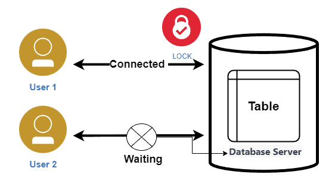
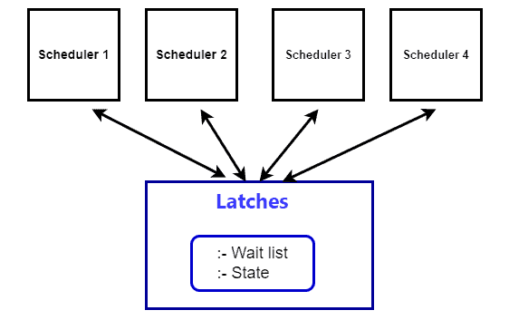
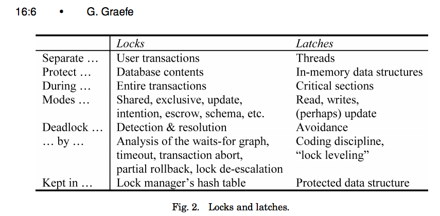
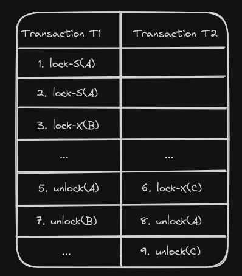

## Topic : Critical Database Concurrency Control Concepts.

Database management systems employ various concurrency control techniques to ensure transactions execute in a consistent and isolated manner when accessing shared data concurrently. Concurrency control techniques are crucial in database systems to maintain data integrity and consistency when multiple transactions are accessing and modifying data concurrently. These techniques allow database systems to effectively utilize available resources and process a higher volume of requests in parallel. In this journal, we'll delve into three essential concepts: locks and latches, two-phase locking, and timestamp ordering concurrency control.

### Locks and Latches
#### Locks

Locks serve as synchronization mechanisms for concurrency control, regulating access to shared data items and ensuring data consistency during concurrent transactions. 

#### Lock Types 

Lock types and granularity vary in method by the degree of concurrency control necessary, pattern of data access as well as the isolation levels used in DBMSs. There are usually mentioned two types of locks used in the databases and that is shared and exclusive locks and among the additional ones there are updated locks. 

 - A shared lock can be requested by many transactions, which means that a transaction can read data item at the same time other transactions are reading it. With regards to databases, write locking is also known as “read exclusion” and shared locks as “read locks”. 

 - In an exclusive lock, one process gets the right to modify the data entity exclusively. This is because when a transaction has an exclusive lock on a data item, this generates a situation in which other transactions are not able to read or write on that item. Mainly an exclusive lock itself can’t exist along with other shared LOCKs or other exclusive LOCKs. By doing so, we make certain that the occurrence of a conflict instance will not happen and the access to the certain data item will be acquired. 

 - An update lock is the kind of lock that occupies the mid-range between a shared lock and an exclusive lock. Its role is to allow two or more readers during the time several writes are not possible. When a transaction holds and update lock on resources, other transactions may be allowed to take only shared lock for the purpose of reading but cannot take an exclusive lock. To avoid the possibility of write skew of being able to bring about wrong outcome, we use update locks. 

#### Latches

Latches are lightweight synchronization mechanisms used for concurrent access control and data consistency within a database management system (DBMS). Or a latch is a synchronization mechanism used for concurrent access control and to ensure data consistency. Database management systems (DBMS) commonly utilize latches to actively safeguard shared resources, such as data structures or buffers, from concurrent access by multiple transactions or threads.

The design of a latch enables rapid acquisition and release, typically occurring within a single CPU cycle, which makes it highly suitable for protecting frequently accessed data structures within a DBMS

Latches can operate in shared and exclusive modes. Shared latches permit concurrent read access by multiple transactions or threads. Exclusive latches offer exclusive write access, preventing simultaneous modifications.

#### Latch Acquisition and Release

When a thread or process needs access to a shared resource protected by a latch, it requests the latch using a function or system call provided by the DBMS. If the latch is already held, the requester enters a spin-wait state, repeatedly checking until the latch becomes available. This spin-waiting approach helps reduce the overhead of context switching but can consume significant CPU cycles if the wait is extended. Once the thread completes its operation on the shared resource, it releases the latch using a corresponding function or system call. The DBMS then notifies waiting threads of the latch's availability, allowing them to compete for acquisition and proceed with their operations. Since latches are frequently acquired and released, latch acquisition and release mechanisms are designed to be quick and efficient, minimizing performance bottlenecks in the system.

#### Locks vs Latches

### Two-Phase Locking Protocol

Two-Phase Locking (2-PL) is a concurrency control protocol that ensures serializability in database transactions. This protocol requires that each transaction locks and unlocks data items in two distinct phases: the growing phase and the shrinking phase.
1. Phases of 2-PL
  - Growing Phase: A transaction may acquire new locks but cannot release any locks.
  - Shrinking Phase: A transaction may release existing locks but cannot acquire any new locks.

During the growing phase, transactions can upgrade locks (e.g., from shared to exclusive), while during the shrinking phase, they can downgrade locks (e.g., from exclusive to shared).
Example: Consider two transactions, T1 and T2:

- For T1: The growing phase is steps 1-3, and the shrinking phase is steps 5-7. The lock point is at step 3.
- For T2: The growing phase is steps 2-6, and the shrinking phase is steps 8-9. The lock point is at step 6.

2. Some limitations and disadvantages of the 2-PL model include the following; 
  - Cascading Rollback: Infer: If a transaction fails, all subsequent transactions that has seen a copy of the uncommitted data of the failed transaction, must also have to be rolled back. Scheduling, for example, can be challenging and complex, leading to greater overhead. 
  - Deadlocks: Two or more transactions can be engaged in transactions and they wait endlessly for each other to release the locks on the data they desire and this results in deadlock. For example: 
   T1: Lock-X(A) -> Lock-X(B) 
   T2: Lock-X(B) -> Lock-X(A) 
  As a result, there is a repetitive waiting for a response, leading to a deadlock. 

  - Concurrency Limitations: Concurrency may be prohibited within the protocol since transactions cannot free locks on items no longer required unless after proceeding to the shrinking phase. This restriction have certain negative impact on the system throughput. 

3. Variants of 2-PL 
 To address the drawbacks of Basic 2-PL, several variants have been developed:To address the drawbacks of Basic 2-PL, several variants have been developed: 
 - Strict 2-PL: If a transaction requires to execute some set of operations which include some records, it takes exclusive locks throughout the transaction’s lifetime until the time of commit/abort. This capability helps in recovering if a process fails as well as prevents chain rollback situations. 
 - Conservative 2-PL: A transaction obtains all the necessary locks during the process of locking before data processing begins. This has eliminated deadlock but can be quite rigid at times. 
 - Rigorous 2-PL: In single-version concurrency control, a transaction acquires all locks (shared and exclusive at the data item level) until it commits or aborts. This give the strongest guarantee with the possible penalty of allowing low level of concurrency. 

#### Locking in Practice
Applications typically don’t acquire a txn’s locks manually (i.e., explicit SQL commands).
Sometimes you need to provide the DBMS with hints to help it to improve concurrency.
 - Update a tuple after reading it.
 - Explicit locks are also useful when doing major changes to the database.

- SHARE Mode: Permits the read and schema change operations but not the data change operations on the object within the same transaction. 
- EXCLUSIVE Mode: Grants all types of DML (Data Manipulation Language) accesses, including read, write, and delete access to the table which will prevent any other access to the table for the moment. 
- FOR UPDATE: Gains a table-level lock on the selected rows to allow processing on those rows to proceed. 
- FOR SHARE: This will obtain a shared lock on the selected rows, essentially preventing other transaction obtaining an exclusive lock on the same rows but allows update within the same transaction. 

Though Two-Phase Locking is paramount in constraining the concurrency transaction processing to produce serializable schedules, it poses certain challenges like cascading rollback and possibilities of deadlock. These problems can be addressed by using the tighter variants of the protocol Strong 2-PL or the Strict 2-PL to control the contention at the cost of a higher number of cycles. Conservative 2-PL will avoid some deadlocks, yet, it can hinder the flexibility of the system. Awareness of these trade-offs will help in the creation of efficient concurrency control mechanisms for use in different database systems. 

### Timestamp Ordering Concurrency Control

Timestamp ordering is a concurrency control method used in database systems to determine the serialization order of transactions. It ensures that the execution of concurrent transactions is equivalent to some serial order, maintaining database consistency.
The core idea is that every transaction is assigned a unique timestamp when it starts. Data items also have read and write timestamp values associated with them. The basic rule is: if a transaction Ti has an earlier timestamp than transaction Tj, then Ti must take precedence and be ordered before Tj in the serialized execution.
For example, if TS(Ti) < TS(Tj), the database system must ensure the execution is equivalent to a serial schedule where Ti appears before Tj.

- The Thomas Write Rule
While the basic timestamp ordering seems straightforward, there is an interesting exception called the Thomas Write Rule that comes into play when a transaction Ti wants to write to a data item X.
Normally, if the existing write timestamp W-TS(X) on X is less than TS(Ti), we would abort Ti to maintain timestamp order consistency. However, the Thomas Write Rule says:
 - If only W-TS(X) < TS(Ti), we can ignore the existing write to X and allow Ti to proceed and write to X.

After Ti writes, we update W-TS(X) to TS(Ti) to record Ti's new write.
However, if any other transaction has already read X before Ti by having R-TS(X) < TS(Ti), then Ti must be aborted to ensure consistency.

This special Thomas Write Rule allows transactions to essentially "overwrite" stale data in certain cases, rather than aborting, which improves concurrency. The Thomas Write Rule tries to balance these tradeoffs by reducing unnecessary transaction aborts in certain write cases, at the cost of slightly increasing the chances of a non-serializable schedule.

- Objectives of Timestamp Ordering
1. Transaction Ordering: Makes sure that these transactions are processed strictly in accordance with their time stamps meaning that if one transaction A has to process before say transaction B, then it has to happen in the exact same way as if these transactions were to be processed one after the other.

2. Conflict Resolution: Resolves conflict situations by choosing whether to abort a transaction or to delay it whilst other transactions which are taking place, are done to ensure that rigidity is not met.

3. Deadlock Prevention: A timestamp based method is used in order to avoid the formation of deadlocks where several transactions continually wait for each other to finish.

- How Timestamp Ordering Works
 The timestamp ordering algorithm operates in two main phases:The timestamp ordering algorithm operates in two main phases:

 - Validation Phase:
 Impose a unique timestamp on the event at the time the transaction occurred.
 Ensures that certain transactions are carried out progressively in line with the timestamps recorded in the blocks.
 It checks and ensures that if one transaction has a time stamp less than the other, it should be executed first.

- Execution Phase:
 Completes transactions according to the sequences identified during the validation process.
 Solves conflicts through pre-empting a transaction with a lower timestamp by aborting it or by solving it by deferring the transaction until the other transaction completes.

- Benefits of Timestamp Ordering
 1. Transaction Consistency: Ensures that the effects are as if all the transactions were processed in a sequential manner, that is, two or more transactions must produce the same impact as a single one carried out at a time.
 2. High Concurrency: Enables the kind of transactions that run in parallel; this increases system capacity and efficiency.
 3. Deadlock Prevention: Prevents deadlock situations since a two-phase timestamp approach is used and the transactions do not wait indefinitely for each other.

Overall, timestamp ordering provides a simple and effective approach to database concurrency control, allowing flexibility through techniques like the Thomas Write Rule. Understanding these concepts is important for building robust database systems. Timestamp ordering is a concurrency management mechanism that gives each transaction a distinct timestamp and arranges the transactions according to those timestamps. The technique guarantees serializability settles disputes between transactions and averts deadlocks. A common concurrency control mechanism in database management systems is timestamp order, which offers high concurrency while guaranteeing transaction consistency.