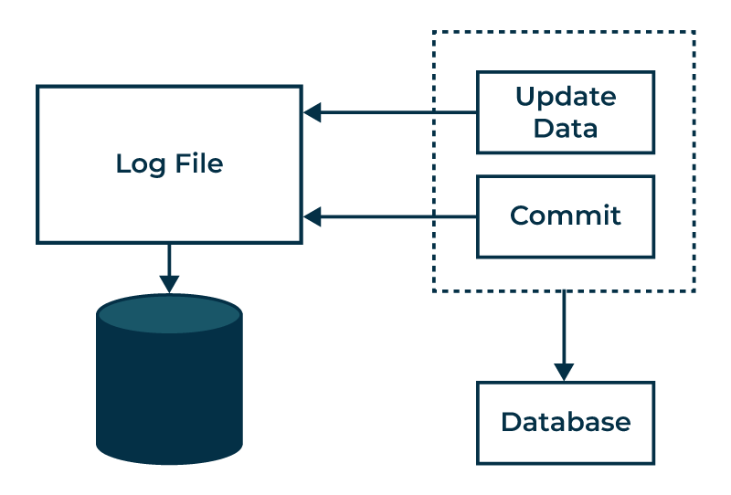
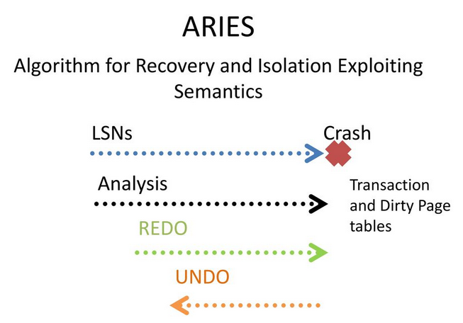
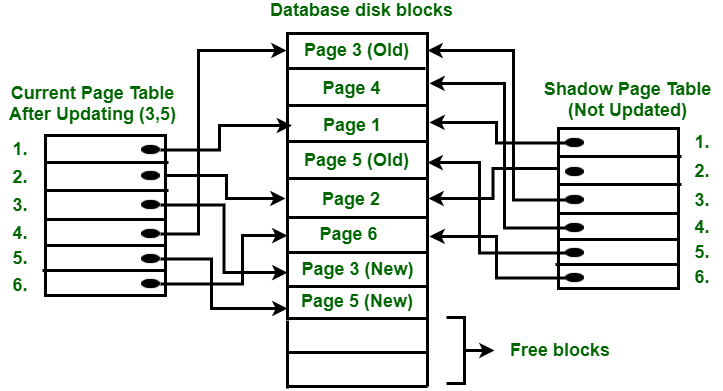
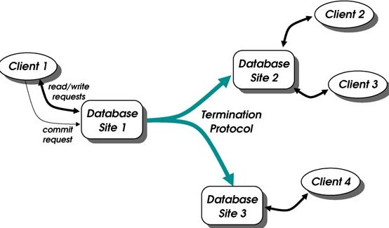

## Topic : Recovery Systems and Algorithm in DBMS 

### Introduction

Today's lesson which I was absent but i had gone through the slides, the lesson deals with backup and recovery models, which form fundamental strategies of any DBMS that addresses issues to do with reliability and longevity of data after certain interference. They are used to guard against system failures, transaction failures, human error and contingencies like natural disasters or hacker attacks. Both of these goals are as follows: They ensure that the data is accurate and consistent by keeping this data integrity; they ensure that the committed transactions at any computer have to be permanent even if a computer crashes through guaranteeing data durability. Need to bring the system back to a stable state is crucial for soon bringing systems back to these states with minimal users’ down time and data loss. They also address the issue of transaction recovery time in accordance with system performance as well as provide multiple ranking schemes for different coherence levels ranging from strictly enforcing ACID to the requirements of the distributed computing environment. Any person responsible for database management must understand these recovery strategies to guarantee that databases persist and are credible in the event of disruption.

### Why Recovery Systems Are Important:
Recovery systems are crucial in DBMS for several reasons:
- System Failures: This is the process of ensuring that the database does not fail completely even in the occurrence of a system crash. 
- Transaction Failures: It ensures that nothing part way through a transaction is changed / updated/ deleted to provide an indication that the transaction completed partially As a result, the transactions are atomic — they either are completed or don’t occur at all, and the database is in a consistent state. 
- Human Errors: Works as a barrier against the ravaging human eviction spree that is common with the other forms of user interfaces. 
- Security Breaches: Can recreate lost files due to hacking or any form of intrusion. 
- Hardware Upgrades: They allow for seamless transfers and migrations, all in one go without any loss of data. 
- Natural Disasters: Precautions accorded to shield physical harm to the storing surface. 
- Compliance Regulations: It helps in compliance of the legal needs for archiving and retrieval of data. 
- Data Corruption: Enhance the ability to prevent data corruption and consequent permanent disappearance of that data. 

### Atomicity of Transactions 
Atomicity is a fundamental property of transactions in DBMS, ensuring that a transaction is treated as a single unit of work. Either all the operations to be executed in that particular transaction occur appropriately or none of the operations occurs, which provides a guarantee of the database’s consistency. This is couched in log-based recovery techniques whereby every transaction is recorded before being adopted by the database itself. 

### Log-Based Recovery 
Log based recovery entails writing all the changes immediately and storing them in the log file. Some of the details recorded in the log are the transaction identifier and the identifier of the data item that has been modified as well as the former and the new value of the affected data tier. This detailed log enables the system to choose the path to undo or redo the transactions to achieve the goal of the system, that is, to provide the network with a consistent state of all the transactions that happened. 

Types of Log Records 
 - Transaction Begin: Marks the start of a transaction.
 - Transaction Commit: Indicates a transaction has successfully completed.
 - Transaction Rollback: Marks a transaction as aborted, requiring its changes to be undone.
 - Update: Records changes to data items, including old and new values.
 - Insert: Logs the addition of new data items.
 - Delete: Captures the removal of data items.
 - Checkpoint: Records the state of all active transactions and data at a specific point, reducing recovery time.
 - Compensation Log Record (CLR): Logs actions taken to reverse changes made by aborted transactions during the undo process.
 - System Log Records: Track significant system-wide events like start and stop operations.
 - Savepoint: Marks specific points within a transaction for partial rollbacks.

These log records are crucial for maintaining data integrity and ensuring robust recovery processes.

### ARIES (Algorithms for Recovery and Isolation Exploiting Semantics) 
The lesson introduced the ARIES (Algorithms for Recovery and Isolation Exploiting Semantics) family of recovery algorithms, developed at IBM Research in the 1990s for the DB2 database system. ARIES is widely adopted, with most modern database systems implementing variations of this approach.

ARIES performs recovery in three main passes:
1. Analysis Pass: 
 - Scans the log forward from the last checkpoint to identify dirty (updated) pages at the time of the crash.
 - Determines the list of transactions that were active (had begun but not committed) at the time of the crash.
 - Finds the first log record that needs to be redone by identifying the oldest interested transaction.

2. Redo Pass: 
 - It is used to commit all actions of committed transactions since the last checkpoint by replaying their log records. 
 - Makes sure that all the committed transaction effects are recorded with the database. 
 - By default, it uses ‘Write-Ahead Logging’ technology to guarantee that the correct log records were written to the hard disk prior to their data pages. 

3. Undo Pass: 
 - Rolls back by working the change record for all active (incomplete) transactions from the log records in reverse order. 
 - Writes compensation log records (CLRs) during undo to enable the program to revive the undo pass in the event of a crash. 

Key Features: 
- Log Records: Compensation, undo/redo, and operation logs go in various ARIES log record types such as update logs. 
- Physiological Redo: Rather than repeating the transactions one by one, ARIES simply re-executes the portion of the log that was invoked, making it more effective. 
- Fuzzy Checkpointing: 
- Enables transactions to stay open during checkpointing; makes the checkpointing process easy and flexible. 
- Log Record Buffering: The application of ARIES is based on the log buffers in memory, while forcing log records to disk only when needed by the Write-Ahead Logging. 
- Parallel Recovery: 

ARIES is designed to accommodate parallel recovery in order to recover data with the help of several CPUs/cores as fast as possible. ARIES also includes optimizations like avoiding logging for temporary data and supporting fine-grained locking for better concurrency during recovery. Its design principles, like Write-Ahead Logging and Repeating History, have influenced many modern database recovery implementations. A core principle of ARIES is Write-Ahead Logging (WAL), which requires that any database change is first recorded in the log on stable storage before the actual data change is written to disk. This ensures that the log always contains enough information to recover correctly.

### Shadow Paging Recovery Technique

Shadow Paging is a recovery technique used in database systems to provide failure atomicity for transactions. The core idea is to treat the database as composed of fixed-size logical pages that are mapped to physical disk blocks via page tables.
Two page tables are maintained:
- Current Page Table - Points to the most recent database pages on disk
- Shadow Page Table - A copy of the current page table before a transaction starts

When a transaction begins, the current page table is copied to create the shadow page table. As the transaction executes, any page updates are performed on new disk blocks, with the current page table entries updated to point to these new blocks. The shadow page entries remain untouched.
- Commit:
   - Write all modified pages from buffers to disk
   - Output the current page table to disk
   - Store the disk address of the current page table, overwriting the old shadow page table address

After commit, the current and shadow tables are identical.

Failure: If a crash occurs before commit, only the modified pages and current table are discarded. The pre-transaction state is recovered by reinstalling the shadow table.

- Advantages:
  - Fewer disk accesses
  - Fast, inexpensive recovery
  - No undo/redo logging required
  - Improved fault tolerance by isolating transactions
  - Increased concurrency as transactions don't interfere
  - Simple to implement

- Disadvantages:
  - Data fragmentation due to relocating updated pages
  - Garbage collection of old pages required
  - Commit overhead of multiple disk writes
  - Concurrency control limitations
  - Implementation challenges for complex systems
  - Limited fault tolerance for crashes after page writes

While Shadow Paging avoids logging overheads, it introduces other complexities like garbage collection and can suffer from performance issues for large transactions or contention scenarios.

### Deferred Update Techniques
The Deferred Update Techniques operate on a way in which the actual update of the individual database is actually deferred (or postponed) until the end of the transaction or when the transaction commits. It means that instead of changing in the database during the transaction, those changes are written in the other separate area or data structure. 

Key points:
- Provides atomicity by deferring updates until commit
- Reduces logging overhead during transaction execution
- Improves concurrency by not blocking reads with uncommitted changes
- Introduces complexity in maintaining and merging the separate update area

Important Aspects:
- Atomicity: Deferred Update Techniques involve the ability of a transaction to have atomicity from the fact that either all updates needed by the transaction will be done or none will with be done. 
- Reduced Logging Overhead: Due to the fact that updates are not necessarily reflected in the database instantly, there is slightly less overhead in logging individual operations throughout the process of executing a transaction. 
- Improved Concurrency: Other transactions can still continue to access the database without being impeded upon by uncommitted changes, which may have been helpful in enhancing concurrency. 
- Implementation Complexity: Main update area with the database integration or including separate update area with the complex data structures or big transactions may lead to the implementation problems. 

Deferred Update Techniques give up some of the logging overhead and possible concurrency benefits for complicated different logical update area to manage and the atomic merge process during commit. They are particularly valuable for those applications where the exactness of the transaction is paramount, and the time and resources necessary to execute immediate updates and logging are undesirable. 

### Conclusion

The lesson also discussed some recovery enhancements for main-memory DBMSs databases whereby information is mostly stored in volatile memory for efficiency. This is attained through avoiding redo logging for index updates, performing cross CPU core recovery and taking often checkpoints but performing only redo recoveries . 
Altogether, this was an enriching session that brought out the importance of recovery system, log generation and recovery algorithms like ARIES in ensuring the integrity of data within the database systems as well as the ability to cope with different failure situations. Thus, backup and recovery models play a critical role in ensuring the reliability and durability of data in DBMS. They employ various strategies, including log-based recovery, ARIES algorithms, Shadow Paging, and Deferred Update Techniques, to handle system failures, transaction failures, and other disruptions, thereby protecting data integrity and minimizing downtime. Understanding these mechanisms is essential for database administrators and developers to effectively manage and safeguard databases against potential threats and ensure their long-term persistence and credibility.