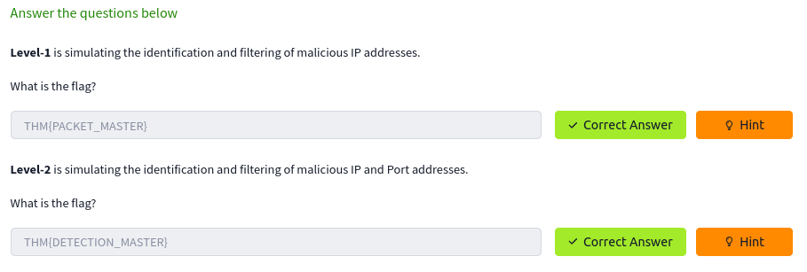

### Topic : Journal entry 6: Traffic Analysis Essentials & Snort

---

Step one, I had established the THM site connection through 'Openvpn', which I managed to do before joining the room. 
 
Having tackled the introduction, I next explored the core areas of Network Security and Traffic Analysis, elucidating the pivotal principles that evenly support the field. The main presentation started with a summary of Network Security which is one of the major elements responsible for cyber safety. In this case, I am willing to address some of the of Network Security particulars, such as authentication and authorization, and the scope of deployed tools, technologies, and methodologies used to provide and measure such implementation. 
 
I then moved on to learn the three basic control levels of Network Security: Physical, Technical, and Administrative. However, the position of each of the levels is rather essential to reach amicable determination for the problem of the unauthorized invasion or threats. The Physical level is mainly responsible for physical securing of critical infrastructure, the Technical level, on the other hand, focuses on a variety of data security measures like firewalls and intrusion detection systems and the Administrative level ensures proper execution by policies and procedures. 
 
Following this, I explored the main approaches to Network Security: Access Control and Threat Control. Gain access is possible only by the appropriate users and network systems by the means of Access Control, and harmful activities and behavior of the users are detected and blocked by implementing Threat Control. Access control is composed of Firewall Protection, NAC Implementation, IAM, Load Balancing, Network Segmentation, VPN and the Zero Trust Models as the main essential elements. The subcategory that for the time being represents Hosting Threat Control consists of the following technologies: Intrusion Detection and Prevention (IDS/IPS), Data Loss Prevention (DLP), Endpoint Protection, Cloud Security, Security Information and Event Management (SIEM), Security Orchestration Automation and Response (SOAR), and Network Traffic Analysis and Network Detection and Response. 
 
The session encompassed the standard practice of Security Management Work, describing the deployment, configuration, management, monitoring, and maintenance steps involved in securing a network. Then, summarizing, I knew about Managed Security Services (MSS) that can be considered as a budget-friendly way to optimize the lack of expertise in house operation security for organizations that lack enough knowledge to do that. The pack has Network Penetration Testing, Vulnerability Assessment, Incident Response and Behavioral Analysis among others being the main services it provides. 
 
Through this microscope, I tried to identify the Traffic Analysis, which is the big method used for tracking the data networks and detecting inconsistencies and abnormalities which are present. Now, at this part of the dialogue, I have explained what is the significance of Traffic Analysis in revealing and analyzing system health issues, network abnormalities and threats. I explored two main techniques used in Traffic Analysis: Flow Analysis and Packet Analysis, both with their strong sides, has its own flakiness. 

There are two main techniques used in Traffic Analysis:

#### A short walkthrough on the Traffic Analysis:
Does the Traffic Analysis Still Matter?
 - The widespread usage of security tools/services and an increasing shift to cloud computing force attackers to modify their tactics and techniques to avoid detection. Network data is a pure and rich data source. Even if it is encoded/encrypted, it still provides a value by pointing to an odd, weird or unexpected pattern/situation. Therefore traffic analysis is still a must-to-have skill for any security analyst who wants to detect and respond to advanced threats.

 - Now you know what Traffic Analysis is and how it operates. Now use the static site to simulate a traffic analysis operation and find the flags.

  

 
  

  

  

   

   

In conclusion, I consider the task of Traffic Analysis as relevant as ever now that these threats are growing at a very fast rate and are directly affecting data security and reliability. The security environment goes continuously forward to the new tools and the services which are created to confront the various forms of cyber-attacks. Nevertheless, Traffic Monitoring goes beyond mere skill of the traitorous security analysts of today who are relentlessly working towards detecting and neutralizing advanced threats. The lecture elaborated on the pillars of network security and traffic analysis, which provided me with the required information and the correct understanding needed when studying in depth on these crucial areas in cybersecurity. 

---

### Snort 

---

This room is like a comprehensive handbook explaining and teaching one to use a network traffic analyzer called Snort2, which is a tool for intrusion detection and prevention. It addresses different modes of operation of Snort, its structure and rules and some key configuration elements. 
 
It begins with Snort that is considered a rule-based open-source NIDS/NIPS tool from Sourcefire spent on its development and maintenance. Next it goes through the process of setting up the provided Virtual Machine environment in which you follow along with the exercises. 

Operating Modes:
 - Sniffer Mode: Leveraging Snort only for polling and logging a large network's traffic. 
 - Packet Logger Mode: The logging was done by analyzing different formats like binary tcpdump, ASCII, etc. 
 - IDS/IPS Mode: Installing Snort as an ID/IPS with pre-configured rules works out. 
 - PCAP Investigation: Analyzing pcap files using the rule engines of Snort will certainly help in detection. 
 
For each of the modes, it describes their respective command line parameters, and it also presents examples of using them. The IDS/IPS section is not distinct, as it contains topics from testing rules, to disableing logging, to running it as a background process, to different types of alerts, and to dropping packets. The document principle continues with the nuts and bolts of Snort rules. The system breaks up its various pieces such as actions, protocols, addresses for the IP, ports, directions and rule options into sections. Rules options are in turn categorized in to general, payload detection and non-payload detections types. Illustrations are there for every rule option. 
 
Lastly, it gives the essentials of file snort. conf. conf while showcasing some important settings, most of which revolve around network variables, decoder settings, output plugins, and rule paths. This reference guide provides an overview of the elements of the Snort tool in various operational modes and examples of Snort rules development as well as interpretation. It gives the basic understanding needed to understand the way Snort is used for network monitoring and analysis or to respond to attacks in real time. The cases and the VM environment have also been created to give the students a chance to practice in a hands-on type of learning. 

This is just the summarization of the room and the overview.

The walkthrough of the room:
#### Introduction to Snort
 - Open Source system with rule-based network intrusion detection/prevention (NIDS/NIPS) method. 
 - Sourcefire/Cisco Talos is the product of both development and maintenance. 

#### The training provider will build an environment conducive to learning. 
 - Instruction: Utilize provided virtual machine
 - A "Task-Exercises" folder is where you will find files that contain exercises for each exercise. 
 - traffic-generator. the h script to provoke the traffic purpose of all exercises

  
 
#### Snort Operating Modes 
1. Sniffer Mode
  - With Snort or tcpdump instead of, we will be able to sniff the packets. 
  - Parameters: -v (verbose), -d (dump data), -e (include headers), -X (show all packet details). 
 
2. Packet Logger Mode
  - Log- record packets and save it to the file
  - Parameters: [-l (location of the log), -K ASCII (ASCI log), -r (read the log)]. 
  - The lecture covers log formats in binary and ASCII systems. 
 
3. IDS/IPS Mode
  - Providing the intrusion detection / prevention system on the Snort based on the rules. 
  - Parameters: nginx. conf, test. conf, ignore log. 
  - Alert modes: FULLCMGL, FASTCMG, CONSOLECMG, CMGNONE, CMGNONE
  - Operate IPS mode to misfire some packets. 
 
4. PCAP Investigation
  - Examine the pcap files using Snort's pattern matcher.  
  - Parameters: -r (read pcap), --pcap-list (read multiple pcaps), --pcap-show (show pcap name)
 
#### Snort Rule Structure
 - Action: alerting, writing to, cutting, refusing
 - Protocol: IP, TCP, UDP, and ICMP protocols. 
 - IP Addresses & Ports: Filtering by the rules, such as source/dest IPs, ports, ranges. 
 - Direction: From Source – Destination( -> >) or Bi-directional (<>)
 
#### Snort Rule Options:
 - General: message, identifying number, reference and revision. 
 - Payload Detection: content, peek ending, random generation, perhaps
 - Non-Payload: flag, tid, dsize, sameip
 
#### Key Configuration File: /etc/snort/snort. conf
 - Network variables: HOME_NET, EXTERN_NET
 - Decoder settings: The mode of IPS contains the dac. 
 - Output plugins: Logging and sending notifications. 
 - Rule paths: Community norms vs leading culture. rules
 
I had given the key pionts in the walkthrough og the room and abou the room, it was divided into three chapters which explain in detail how to run Snort in different operational modes, what the structure of Snort rules is like, and which aspects of the configuration are most important - all illustrated with examples and a full VM environment. 